# RBAC-SSO Multi-Tenant E-Commerce POC

基於 .NET 8.0 的多租戶電子商務平台 POC，展示企業級 RBAC 權限控制與 SSO 單一登入整合。

## 目錄

- [專案概述](#專案概述)
- [技術架構](#技術架構)
- [系統架構圖](#系統架構圖)
- [架構原則](#架構原則)
- [資料模型 (ER Diagram)](#資料模型-er-diagram)
- [類別圖](#類別圖)
- [循序圖](#循序圖)
- [API 清單](#api-清單)
- [快速開始](#快速開始)
- [測試案例](#測試案例)
- [專案結構](#專案結構)

---

## 專案概述

### 核心功能

| 功能 | 描述 |
|------|------|
| **SSO 單一登入** | OAuth2/OIDC 整合 Keycloak，支援 LDAP 使用者同步 |
| **RBAC 權限控制** | 四種角色：ADMIN、TENANT_ADMIN、USER、VIEWER |
| **多租戶隔離** | 確保租戶間資料完全隔離 |
| **Domain Events 稽核** | 所有重要操作透過領域事件記錄完整稽核日誌 |
| **CQRS 架構** | 命令查詢責任分離，提高系統擴展性 |

### 角色權限矩陣

| 端點 | ADMIN | TENANT_ADMIN | USER | VIEWER |
|------|-------|--------------|------|--------|
| GET /api/products | ✅ | ✅ | ✅ | ✅ |
| POST /api/products | ✅ | ✅ | ❌ | ❌ |
| PUT /api/products/{id} | ✅ | ✅ | ❌ | ❌ |
| DELETE /api/products/{id} | ✅ | ❌ | ❌ | ❌ |
| GET /api/audit/logs | ✅ | ✅ | ❌ | ❌ |

---

## 技術架構

### 技術棧

| 類別 | 技術 | 版本 |
|------|------|------|
| Runtime | .NET | 8.0 LTS |
| Web Framework | ASP.NET Core | 8.0 |
| ORM | Entity Framework Core | 8.0 |
| Mediator | MediatR | 12.x |
| API Gateway | YARP | 2.x |
| 多租戶 | Finbuckle.MultiTenant | 7.x |
| 認證服務 | Keycloak | 24.x |
| 資料庫 | PostgreSQL | 15+ |
| 目錄服務 | OpenLDAP | 2.6 |

### 測試框架

| 類別 | 技術 |
|------|------|
| 單元測試 | xUnit + Moq |
| BDD 測試 | Reqnroll |
| 整合測試 | WebApplicationFactory + Testcontainers |
| 架構測試 | NetArchTest |

---

## 系統架構圖

### 整體架構


### Hexagonal Architecture (六邊形架構)


---

## 架構原則

### 依賴規則

| 層級 | 可依賴 | 禁止依賴 |
|------|--------|----------|
| Domain | 無 | Application, Infrastructure, Api, 外部框架 |
| Application | Domain | Infrastructure, Api |
| Infrastructure | Application, Domain | Api |
| Api | Infrastructure, Application, Domain | - |

### Domain 層禁用的框架

為確保領域層的純淨性，以下框架禁止在 Domain 層使用：

- `Microsoft.EntityFrameworkCore`
- `MediatR`
- `Microsoft.AspNetCore`
- `FluentValidation`
- `Npgsql`
- `System.Net.Http`
- `Microsoft.Extensions.DependencyInjection`

### Ports & Adapters

**Ports（Application 層定義的介面）：**

| Port | 說明 |
|------|------|
| `IProductRepository` | 產品聚合儲存庫 |
| `IProductQueryRepository` | 產品查詢儲存庫（CQRS 讀取端） |
| `IDomainEventDispatcher` | 領域事件發布 |
| `ICurrentUserService` | 當前使用者資訊 |

**Adapters（Infrastructure 層實作）：**

| Adapter | 實作的 Port |
|---------|-------------|
| `ProductRepository` | `IProductRepository` (EF Core) |
| `ProductQueryRepository` | `IProductQueryRepository` (EF Core) |
| `MediatRDomainEventDispatcher` | `IDomainEventDispatcher` |

---

## 資料模型 (ER Diagram)


### 索引設計

| 資料表 | 索引名稱 | 欄位 |
|--------|----------|------|
| products | pk_products | (id) PRIMARY KEY |
| products | uk_products_code | (product_code) UNIQUE |
| products | idx_products_tenant | (tenant_id) |
| products | idx_products_category | (category) |
| products | idx_products_status | (status) |
| audit_logs | pk_audit_logs | (id) PRIMARY KEY |
| audit_logs | idx_audit_timestamp | (timestamp DESC) |
| audit_logs | idx_audit_username | (username, timestamp DESC) |
| audit_logs | idx_audit_aggregate | (aggregate_type, aggregate_id, timestamp DESC) |
| audit_logs | idx_audit_event_type | (event_type, timestamp DESC) |
| audit_logs | idx_audit_correlation | (correlation_id) |

---

## 類別圖

### Domain Layer 類別圖


---

## 循序圖

### 商品建立流程 (含 Domain Events 稽核)

```mermaid
sequenceDiagram
    autonumber
    participant C as Client
    participant Ctrl as Controller
    participant H as Handler
    participant P as Product
    participant M as MediatR
    participant AH as AuditHandler

    C->>Ctrl: POST /products
    Ctrl->>H: Send CreateProductCommand
    H->>P: Create()
    P->>P: RegisterEvent(ProductCreated)
    P-->>H: return product
    H->>H: Save to DB
    H->>P: PullDomainEvents()
    P-->>H: return events[]
    H->>M: Publish(ProductCreated)
    M->>AH: Handle()
    AH->>AH: Create AuditLog
    AH-->>M: completed
    M-->>H: completed
    H-->>Ctrl: ProductDto
    Ctrl-->>C: 201 Created
```



### OAuth2 認證流程


---

## API 清單

### 認證 API

| Method | Endpoint | 說明 | Auth |
|--------|----------|------|------|
| GET | /api/auth/login | 發起 OAuth2 登入流程 | 無 |
| GET | /api/auth/callback | OAuth2 回呼端點 | 無 |
| POST | /api/auth/refresh | 刷新 Token | 無 |
| GET | /api/auth/me | 取得當前使用者資訊 | Bearer |
| POST | /api/auth/logout | 登出 | Bearer |

### 商品 API

| Method | Endpoint | 說明 | Auth | 角色 |
|--------|----------|------|------|------|
| GET | /api/products | 商品列表 (分頁、篩選、排序) | Bearer | 全部 |
| GET | /api/products/{id} | 商品詳情 | Bearer | 全部 |
| POST | /api/products | 建立商品 | Bearer | ADMIN, TENANT_ADMIN |
| PUT | /api/products/{id} | 更新商品 | Bearer | ADMIN, TENANT_ADMIN |
| DELETE | /api/products/{id} | 刪除商品 (軟刪除) | Bearer | ADMIN |

### 稽核 API

| Method | Endpoint | 說明 | Auth | 角色 |
|--------|----------|------|------|------|
| GET | /api/audit/logs | 稽核日誌列表 | Bearer | ADMIN, TENANT_ADMIN |
| GET | /api/audit/logs/{id} | 稽核日誌詳情 | Bearer | ADMIN, TENANT_ADMIN |
| GET | /api/audit/logs/by-user/{username} | 依使用者查詢 | Bearer | ADMIN |
| GET | /api/audit/logs/by-correlation/{id} | 依關聯 ID 查詢 | Bearer | ADMIN |

### 使用者 API

| Method | Endpoint | 說明 | Auth | 角色 |
|--------|----------|------|------|------|
| GET | /api/users/me | 當前使用者資訊 | Bearer | 全部 |
| GET | /api/admin/users | 使用者列表 | Bearer | ADMIN |

### Swagger UI

服務啟動後可透過以下 URL 存取 API 文件：

- **Gateway**: http://localhost:8080/swagger
- **Product Service**: http://localhost:8081/swagger
- **User Service**: http://localhost:8082/swagger
- **Audit Service**: http://localhost:8083/swagger

---

## 快速開始

### 環境需求

- .NET 8.0 SDK
- Docker Desktop
- IDE: Visual Studio 2022 / JetBrains Rider / VS Code

### 1. 啟動基礎設施

```bash
cd rbac-sso-poc-dotnet/deploy/docker
docker-compose up -d
```

### 2. 等待服務就緒

```bash
# 檢查 Keycloak 健康狀態
curl http://localhost:8180/health/ready

# 檢查 PostgreSQL
docker-compose ps postgres
```

### 3. 建置與執行

```bash
cd rbac-sso-poc-dotnet
dotnet build
dotnet run --project src/Services/RbacSso.Gateway
```

### 4. 取得 Token

```bash
TOKEN=$(curl -s -X POST "http://localhost:8180/realms/ecommerce/protocol/openid-connect/token" \
  -H "Content-Type: application/x-www-form-urlencoded" \
  -d "grant_type=password" \
  -d "client_id=gateway" \
  -d "client_secret=gateway-secret" \
  -d "username=admin" \
  -d "password=admin" | jq -r '.access_token')
```

### 5. 測試 API

```bash
# 建立商品
curl -X POST "http://localhost:8080/api/products" \
  -H "Authorization: Bearer $TOKEN" \
  -H "Content-Type: application/json" \
  -d '{
    "name": "測試商品",
    "price": 99.99,
    "category": "Electronics",
    "description": "測試商品描述"
  }'
```

### 預設帳號

| 使用者 | 密碼 | 角色 | 租戶 |
|--------|------|------|------|
| admin | admin | ADMIN | system |
| tenant-a-admin | password | TENANT_ADMIN | tenant-a |
| tenant-b-admin | password | TENANT_ADMIN | tenant-b |
| user-a | password | USER | tenant-a |
| viewer | password | VIEWER | tenant-a |

---

## 測試案例

### BDD 測試場景 (Reqnroll)

#### 認證場景 (Authentication.feature)

```gherkin
@US1 @Authentication
場景: 成功登入取得 JWT Token
  假設 一個使用者 "admin" 在 Keycloak 中擁有有效憑證
  而且 該使用者擁有角色 "ADMIN"
  當 使用者透過平台發起登入
  那麼 使用者收到有效的 JWT Token
  而且 Token 包含角色 "ADMIN"
```

#### 商品管理場景 (ProductManagement.feature)

```gherkin
@US2 @Products
場景: ADMIN 建立新商品
  假設 使用者 "admin" 已登入系統，角色為 "ADMIN"
  當 使用者建立商品:
    | 商品名稱   | 價格 | 分類     |
    | 測試商品 A | 1000 | 電子產品 |
  那麼 系統應回傳成功訊息
  而且 商品應該被成功建立
  而且 應產生 "ProductCreated" 稽核事件

場景: VIEWER 無法建立商品
  假設 使用者 "viewer" 已登入系統，角色為 "VIEWER"
  當 使用者嘗試建立商品
  那麼 系統應回傳 403 Forbidden
  而且 應產生 "PermissionDenied" 稽核事件
```

#### 多租戶隔離場景 (MultiTenant.feature)

```gherkin
@US3 @MultiTenancy
場景: 租戶只能查看自己的商品
  假設 租戶 "tenant-a" 有商品 "商品 A1" 和 "商品 A2"
  而且 租戶 "tenant-b" 有商品 "商品 B1"
  當 租戶 "tenant-a" 的使用者查詢商品列表
  那麼 只應看到屬於 "tenant-a" 的商品
  而且 不應看到 "tenant-b" 的商品
```

### 執行測試

```bash
# 所有測試
dotnet test

# 單元測試
dotnet test --filter Category=Unit

# 整合測試
dotnet test --filter Category=Integration

# BDD 測試
dotnet test --filter Category=BDD

# 架構測試
dotnet test --filter Category=Architecture

# 產生覆蓋率報告
dotnet test --collect:"XPlat Code Coverage"
```

---

## 專案結構

```
rbac-sso-poc-dotnet/
├── src/
│   ├── Services/
│   │   ├── RbacSso.Gateway/           # API Gateway (YARP)
│   │   ├── RbacSso.ProductService/    # 商品服務
│   │   │   ├── Domain/                # 領域層 (純 C#)
│   │   │   ├── Application/           # 應用層 (CQRS)
│   │   │   ├── Infrastructure/        # 基礎設施層
│   │   │   └── Api/                   # API 層
│   │   ├── RbacSso.UserService/       # 使用者服務
│   │   └── RbacSso.AuditService/      # 稽核服務
│   │
│   └── Shared/
│       ├── RbacSso.Common/            # 共用元件
│       ├── RbacSso.Security/          # 安全模組
│       ├── RbacSso.Tenant/            # 多租戶模組
│       └── RbacSso.Audit/             # 稽核模組
│
├── tests/
│   ├── RbacSso.ArchitectureTests/     # 架構測試
│   ├── RbacSso.ProductService.UnitTests/
│   ├── RbacSso.ProductService.IntegrationTests/
│   └── RbacSso.ScenarioTests/         # BDD 測試
│       └── Features/
│           ├── Authentication.feature
│           ├── ProductManagement.feature
│           ├── MultiTenant.feature
│           └── AuditLogging.feature
│
├── deploy/
│   ├── docker/
│   │   ├── docker-compose.yml
│   │   └── keycloak/
│   │       └── realm-export.json
│   └── k8s/
│
├── specs/                             # 規格文件
│   └── 001-rbac-sso-poc/
│       ├── spec.md                    # 功能規格
│       ├── plan.md                    # 實作計畫
│       ├── tasks.md                   # 任務清單
│       ├── data-model.md              # 資料模型
│       ├── research.md                # 技術研究
│       ├── quickstart.md              # 快速開始
│       └── contracts/
│           └── openapi.yaml           # API 契約
│
├── RbacSso.sln
└── Directory.Build.props
```

---

## 授權條款

此專案為概念驗證 (POC) 專案，僅供學習與展示用途。

---

## 相關文件

- [功能規格](specs/001-rbac-sso-poc/spec.md)
- [實作計畫](specs/001-rbac-sso-poc/plan.md)
- [任務清單](specs/001-rbac-sso-poc/tasks.md)
- [資料模型](specs/001-rbac-sso-poc/data-model.md)
- [API 契約](specs/001-rbac-sso-poc/contracts/openapi.yaml)
- [快速開始](specs/001-rbac-sso-poc/quickstart.md)
