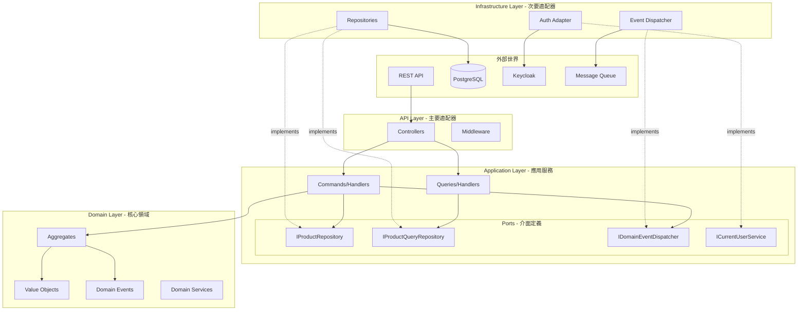
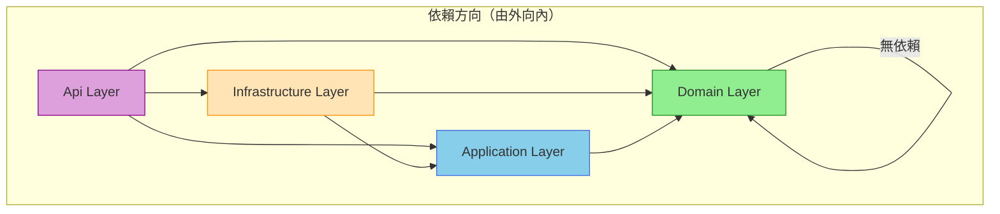
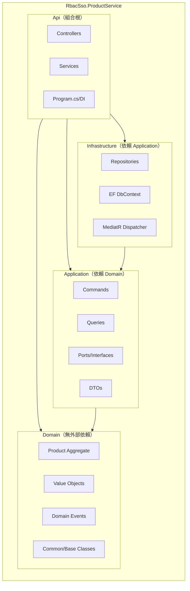
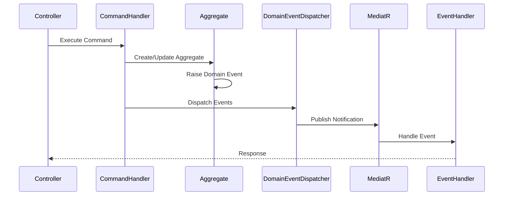

# RBAC-SSO Multi-Tenant E-Commerce POC

基於六角形架構（Hexagonal Architecture）的多租戶電子商務 POC，整合 Keycloak SSO 與 RBAC 權限控制。

## 架構概覽

### 六角形架構（Ports & Adapters）



### 層級依賴關係



### ProductService 專案結構



### 領域事件流程



## 專案結構

```
src/
├── Services/
│   ├── RbacSso.ProductService.Domain/        # 領域層（純 C#，無外部依賴）
│   │   ├── Common/                           # 基礎類別
│   │   │   ├── IDomainEvent.cs
│   │   │   ├── AggregateRoot.cs
│   │   │   ├── Entity.cs
│   │   │   ├── ValueObject.cs
│   │   │   └── Exceptions.cs
│   │   └── Products/                         # Product 聚合
│   │       ├── Product.cs
│   │       ├── ProductId.cs
│   │       ├── ProductCode.cs
│   │       ├── Money.cs
│   │       ├── ProductStatus.cs
│   │       └── Events/
│   │
│   ├── RbacSso.ProductService.Application/   # 應用層（定義 Port）
│   │   ├── Ports/                            # 介面定義
│   │   │   ├── IProductRepository.cs
│   │   │   ├── IProductQueryRepository.cs
│   │   │   ├── IDomainEventDispatcher.cs
│   │   │   └── ICurrentUserService.cs
│   │   ├── Products/
│   │   │   ├── Commands/
│   │   │   ├── Queries/
│   │   │   └── DTOs/
│   │   └── Common/
│   │
│   ├── RbacSso.ProductService.Infrastructure/ # 基礎設施層（實作 Adapter）
│   │   ├── Persistence/
│   │   │   ├── ProductDbContext.cs
│   │   │   ├── Configurations/
│   │   │   └── Repositories/
│   │   └── Events/
│   │       └── MediatRDomainEventDispatcher.cs
│   │
│   ├── RbacSso.ProductService.Api/           # API 層（組合根）
│   │   ├── Controllers/
│   │   ├── Services/
│   │   └── Program.cs
│   │
│   ├── RbacSso.Gateway/                      # API Gateway
│   ├── RbacSso.UserService/                  # 使用者服務
│   └── RbacSso.AuditService/                 # 審計服務
│
├── Shared/
│   ├── RbacSso.Common/                       # 共用元件
│   ├── RbacSso.Security/                     # 安全相關
│   ├── RbacSso.Tenant/                       # 多租戶
│   └── RbacSso.Audit/                        # 審計
│
tests/
├── RbacSso.ProductService.Domain.UnitTests/  # 領域層單元測試
├── RbacSso.ArchitectureTests/                # 架構合規測試
└── ...
```

## 架構原則

### 依賴規則

| 層級 | 可依賴 | 禁止依賴 |
|------|--------|----------|
| Domain | 無 | Application, Infrastructure, Api, 外部框架 |
| Application | Domain | Infrastructure, Api |
| Infrastructure | Application, Domain | Api |
| Api | Infrastructure, Application, Domain | - |

### Domain 層禁用的框架

- `Microsoft.EntityFrameworkCore`
- `MediatR`
- `Microsoft.AspNetCore`
- `FluentValidation`
- `Npgsql`
- `System.Net.Http`
- `Microsoft.Extensions.DependencyInjection`

### Ports & Adapters

**Ports（Application 層定義的介面）：**
- `IProductRepository` - 產品聚合儲存庫
- `IProductQueryRepository` - 產品查詢儲存庫（CQRS 讀取端）
- `IDomainEventDispatcher` - 領域事件發布
- `ICurrentUserService` - 當前使用者資訊

**Adapters（Infrastructure 層實作）：**
- `ProductRepository` - EF Core 實作
- `ProductQueryRepository` - EF Core 查詢實作
- `MediatRDomainEventDispatcher` - MediatR 事件發布實作

## 快速開始

### 前置需求

- .NET 8.0 SDK
- Docker & Docker Compose
- PostgreSQL 15+
- Keycloak 22+

### 啟動服務

```bash
# 啟動基礎設施
docker-compose up -d

# 執行遷移
dotnet ef database update -p src/Services/RbacSso.ProductService.Infrastructure

# 啟動 API
dotnet run --project src/Services/RbacSso.ProductService.Api
```

### 執行測試

```bash
# 執行所有測試
dotnet test

# 執行架構測試
dotnet test tests/RbacSso.ArchitectureTests

# 執行單元測試（含覆蓋率）
dotnet test tests/RbacSso.ProductService.Domain.UnitTests --collect:"XPlat Code Coverage"
```

## API 端點

| Method | Endpoint | 說明 |
|--------|----------|------|
| GET | /api/products | 取得產品列表 |
| GET | /api/products/{id} | 取得單一產品 |
| POST | /api/products | 建立產品 |
| PUT | /api/products/{id} | 更新產品 |
| DELETE | /api/products/{id} | 刪除產品 |

## 技術棧

- **Runtime**: .NET 8.0
- **Database**: PostgreSQL 15 + EF Core 8
- **Authentication**: Keycloak 22 (OIDC/JWT)
- **Architecture**: Hexagonal Architecture / Clean Architecture
- **Testing**: xUnit, FluentAssertions, NetArchTest
- **Documentation**: Swagger/OpenAPI

## 授權

MIT License
